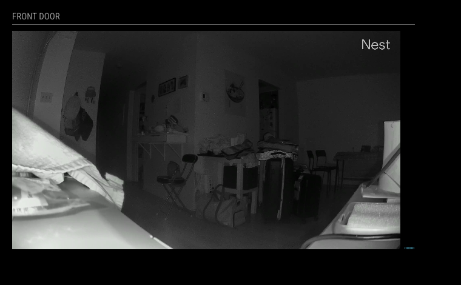

# MMM-Nest-Camera-WebRTC

A [MagicMirror²](https://github.com/MichMich/MagicMirror) module that displays a live WebRTC stream from a Google Nest camera via the Device Access API. Includes an audio frequency visualizer synced to the camera's audio track.



---

## Requirements

- Node.js **v18 or higher**
- A [Google Cloud project](https://console.cloud.google.com) with the **Smart Device Management API** enabled
- A project registered in the [Device Access Console](https://console.nest.google.com/device-access/project-list) (one-time $5 fee to Google)
- OAuth 2.0 credentials (Client ID + Secret) from Google Cloud Console

> **Supported cameras:** Nest Cam (indoor/outdoor), Nest Doorbell. Older "Works with Nest" devices do not support WebRTC.

---

## What Credentials Do I Need?

| Credential | Config field | Where to get it |
|---|---|---|
| OAuth Client ID | `nestClientId` | [Google Cloud Console](https://console.cloud.google.com) → APIs & Services → Credentials |
| OAuth Client Secret | `nestClientSecret` | Same as above |
| Project ID | `nestProjectId` | [Device Access Console](https://console.nest.google.com/device-access/project-list) |
| Device ID | `nestDeviceId` | Nest API device list (see [Getting your Device ID](#getting-your-device-id)) |

---

## Installation

**1. Navigate to your MagicMirror `modules` folder:**

```bash
cd ~/MagicMirror/modules
```

**2. Clone this repository:**

```bash
git clone https://github.com/brandaorafael/MMM-Nest-Camera-WebRTC
```

**3. Install dependencies:**

```bash
cd MMM-Nest-Camera-WebRTC && npm install
```

**4. Add the module to your `config/config.js`** with your credentials (see [Configuration](#configuration)).

**5. Complete the OAuth setup** — get an authorization URL, visit it, then exchange the code for tokens:

```bash
# From your MagicMirror root:
node modules/MMM-Nest-Camera-WebRTC/exchange-nest-code.js "YOUR_AUTH_CODE"
```

This writes a `tokens.json` file to the module folder. The module reads this file on startup and auto-refreshes the token — you only need to do this once.

> **Where do I get the auth code?** If `tokens.json` is missing and no `nestCode` is set, the module will show "Nest camera requires authentication" with a link. Visit that link, authorize with your Google account, and copy the `code=` value from the redirect URL.

---

## Getting your Device ID

After completing OAuth setup, list your devices with curl:

```bash
ACCESS_TOKEN=$(node -e "console.log(require('./modules/MMM-Nest-Camera-WebRTC/tokens.json').access_token)")

curl -s -H "Authorization: Bearer $ACCESS_TOKEN" \
  "https://smartdevicemanagement.googleapis.com/v1/enterprises/YOUR_PROJECT_ID/devices" \
  | grep -A2 '"name"'
```

The device ID is the last segment of the `name` field, e.g. `enterprises/project-id/devices/AVPHwEuBfnPOnTqzVFT4...` → the Device ID is `AVPHwEuBfnPOnTqzVFT4...`.

---

## Configuration

```javascript
{
  module: "MMM-Nest-Camera-WebRTC",
  position: "bottom_left",
  config: {
    nestProjectId: "your-project-id",
    nestDeviceId: "your-device-id",
    nestClientId: "your-oauth-client-id",
    nestClientSecret: "your-oauth-client-secret"
  }
}
```

### Configuration Options

| Option | Default | Description |
|---|---|---|
| `nestProjectId` | `""` | **Required.** Your Device Access project ID. |
| `nestDeviceId` | `""` | **Required.** The Nest camera device ID. |
| `nestClientId` | `""` | **Required.** OAuth 2.0 client ID from Google Cloud Console. |
| `nestClientSecret` | `""` | **Required.** OAuth 2.0 client secret from Google Cloud Console. |
| `nestCode` | `""` | One-time OAuth authorization code. Set this before first run, then clear it after `tokens.json` is written — or pass the code directly to `exchange-nest-code.js` instead. |
| `width` | `"33%"` | CSS width of the video element (e.g. `"33%"`, `"480px"`). |
| `reconnectDelay` | `3000` | Milliseconds to wait before reconnecting after a connection failure. |
| `extendInterval` | `240000` | Interval (ms) at which the stream session is extended. Nest sessions expire after 5 minutes; this must be less than `300000`. |
| `hiddenOnStartup` | `false` | When `true`, defers the WebRTC connection until the module is made visible (e.g. by a `SHOW_MODULE` notification). |

---

## USER_PRESENCE Integration

The module listens for `USER_PRESENCE` notifications, compatible with modules like [MMM-PIR-Sensor](https://github.com/paviro/MMM-PIR-Sensor). When presence is lost the stream is suspended; when presence returns the stream resumes automatically.

```javascript
// Example: pair with MMM-PIR-Sensor
{ module: "MMM-PIR-Sensor", config: { ... } }
```

No extra configuration needed — the module handles the `USER_PRESENCE` notification out of the box.

---

## Updating

```bash
cd ~/MagicMirror/modules/MMM-Nest-Camera-WebRTC
git pull
npm install
```

---

## Troubleshooting

**"Nest camera requires authentication" shown on the mirror**
- Visit the authorization link shown in the module, complete the Google sign-in, and copy the `code=` value from the redirect URL.
- Run: `node modules/MMM-Nest-Camera-WebRTC/exchange-nest-code.js "YOUR_CODE"`
- If `tokens.json` is missing entirely, the initial OAuth setup was never completed.

**"Connecting to Nest camera..." shown indefinitely**
- Check `nestProjectId` and `nestDeviceId` are correct.
- Verify the camera is online in the Google Home app.
- Check the MagicMirror log for `[MMM-Nest-Camera-WebRTC]` error lines.

**`Nest API error` / 401 in the log**
- Your access token expired and the refresh also failed. Re-run `exchange-nest-code.js` with a fresh code to get new tokens.
- If the log shows `Token expired and no refresh token available`, your `tokens.json` is missing a `refresh_token` — re-authorize with `access_type=offline&prompt=consent` (the auth URL shown by the module includes these).

**`Extend stream failed` in the log**
- A non-401 error from the Extend API (usually `400 FAILED_PRECONDITION`) means the session became invalid. The module will automatically trigger a full reconnect — no action needed.

**`EXTEND_STREAM notification failed` in the log**
- The frontend failed to send the extend notification, usually because the peer connection was already torn down. The auto-reconnect will re-establish the stream.

**Video not appearing after stream connects**
- Confirm the camera model supports WebRTC (Nest Cam and Doorbell models do).
- Check for `Video playback failed` warnings in the log — this usually indicates an Electron autoplay policy issue.

**Stream stops after exactly 5 minutes**
- `extendInterval` must be less than `300000`. The default `240000` (4 min) is correct — verify your config hasn't overridden it to a value ≥ 300000.

---

Based on the work done by [@shbatm](https://github.com/shbatm) for [MMM-RTSPtoWeb](https://github.com/shbatm/MMM-RTSPtoWeb)
