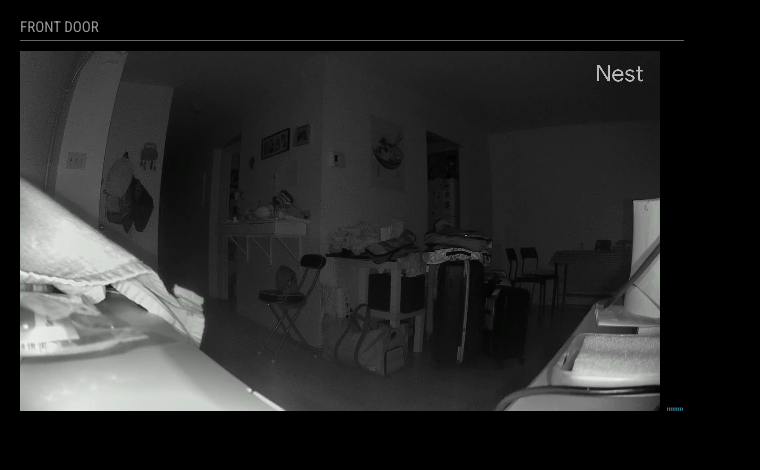

# MMM-Nest-Camera-WebRTC

A [MagicMirror²](https://github.com/MichMich/MagicMirror) module that displays live WebRTC streams from one or more Google Nest cameras via the Device Access API. Supports a **hero + thumbnails** layout with auto-cycling and remote-controllable camera switching. Includes an audio frequency visualizer synced to the hero camera's audio track.



---

## Requirements

- Node.js **v18 or higher**
- A [Google Cloud project](https://console.cloud.google.com) with the **Smart Device Management API** enabled
- A project registered in the [Device Access Console](https://console.nest.google.com/device-access/project-list) (one-time $5 fee to Google)
- OAuth 2.0 credentials (Client ID + Secret) from Google Cloud Console

> **Supported cameras:** Nest Cam (indoor/outdoor), Nest Doorbell. Older "Works with Nest" devices do not support WebRTC.

---

## What Credentials Do I Need?

| Credential | Config field | Where to get it |
|---|---|---|
| OAuth Client ID | `nestClientId` | [Google Cloud Console](https://console.cloud.google.com) → APIs & Services → Credentials |
| OAuth Client Secret | `nestClientSecret` | Same as above |
| Project ID | `nestProjectId` | [Device Access Console](https://console.nest.google.com/device-access/project-list) |
| Device ID | `nestDeviceId` | Nest API device list (see [Getting your Device ID](#getting-your-device-id)) |

---

## Installation

**1. Navigate to your MagicMirror `modules` folder:**

```bash
cd ~/MagicMirror/modules
```

**2. Clone this repository:**

```bash
git clone https://github.com/brandaorafael/MMM-Nest-Camera-WebRTC
```

**3. Install dependencies:**

```bash
cd MMM-Nest-Camera-WebRTC && npm install
```

**4. Add the module to your `config/config.js`** with your credentials (see [Configuration](#configuration)).

**5. Complete the OAuth setup** — get an authorization URL, visit it, then exchange the code for tokens:

```bash
# From your MagicMirror root:
node modules/MMM-Nest-Camera-WebRTC/exchange-nest-code.js "YOUR_AUTH_CODE"
```

This writes a `tokens.json` file to the module folder. The module reads this file on startup and auto-refreshes the token — you only need to do this once.

> **Where do I get the auth code?** If `tokens.json` is missing and no `nestCode` is set, the module will show "Nest camera requires authentication" with a link. Visit that link, authorize with your Google account, and copy the `code=` value from the redirect URL.

---

## Getting your Device ID

After completing OAuth setup, list your devices with curl:

```bash
ACCESS_TOKEN=$(node -e "console.log(require('./modules/MMM-Nest-Camera-WebRTC/tokens.json').access_token)")

curl -s -H "Authorization: Bearer $ACCESS_TOKEN" \
  "https://smartdevicemanagement.googleapis.com/v1/enterprises/YOUR_PROJECT_ID/devices" \
  | grep -A2 '"name"'
```

The device ID is the last segment of the `name` field, e.g. `enterprises/project-id/devices/AVPHwEuBfnPOnTqzVFT4...` → the Device ID is `AVPHwEuBfnPOnTqzVFT4...`.

---

## Configuration

```javascript
{
  module: "MMM-Nest-Camera-WebRTC",
  position: "bottom_left",
  config: {
    nestProjectId: "your-project-id",
    nestDeviceId: "your-device-id",
    nestClientId: "your-oauth-client-id",
    nestClientSecret: "your-oauth-client-secret"
  }
}
```

### Configuration Options

| Option | Default | Description |
|---|---|---|
| `nestProjectId` | `""` | **Required.** Your Device Access project ID. Shared by all cameras. |
| `nestClientId` | `""` | **Required.** OAuth 2.0 client ID from Google Cloud Console. Shared by all cameras. |
| `nestClientSecret` | `""` | **Required.** OAuth 2.0 client secret from Google Cloud Console. Shared by all cameras. |
| `nestDeviceId` | `""` | Single-camera setups: the Nest camera device ID. Ignored when `cameras` is set. |
| `cameras` | `[]` | Multi-camera setups: an array of `{ name, nestDeviceId }` objects (see [Multi-Camera](#multi-camera)). |
| `layout` | `"hero"` | Layout mode. `"hero"` = one large camera + thumbnail strip. `"grid"` / `"carousel"` / `"focus"` are reserved for a future release and currently fall back to `hero`. |
| `cycleInterval` | `0` | Milliseconds between automatic hero-camera rotations. `0` disables auto-cycling. |
| `heroWidth` | `null` | CSS width of the hero camera (e.g. `"33%"`, `"640px"`). Falls back to `width`. |
| `thumbWidth` | `"15%"` | CSS width of each thumbnail camera. |
| `width` | `"33%"` | CSS width of the video element for single-camera setups / hero fallback. |
| `nestCode` | `""` | One-time OAuth authorization code. Set this before first run, then clear it after `tokens.json` is written — or pass the code directly to `exchange-nest-code.js` instead. |
| `reconnectDelay` | `3000` | Milliseconds to wait before reconnecting after a connection failure. Can be overridden per-camera. |
| `extendInterval` | `240000` | Interval (ms) at which the stream session is extended. Nest sessions expire after 5 minutes; this must be less than `300000`. Can be overridden per-camera. |
| `hiddenOnStartup` | `false` | When `true`, defers the WebRTC connection until the module is made visible (e.g. by a `SHOW_MODULE` notification). |

---

## Multi-Camera

To show multiple cameras, put the shared account credentials at the top level and list each camera in the `cameras` array. Every camera uses the same Google account / OAuth credentials, so you only authenticate once.

```javascript
{
  module: "MMM-Nest-Camera-WebRTC",
  position: "bottom_left",
  config: {
    // Shared account credentials
    nestProjectId: "your-project-id",
    nestClientId: "your-oauth-client-id",
    nestClientSecret: "your-oauth-client-secret",

    // Layout + behaviour
    layout: "hero",
    cycleInterval: 15000,   // rotate the hero camera every 15s (0 = off)
    heroWidth: "40%",
    thumbWidth: "18%",

    cameras: [
      { name: "Front Door", nestDeviceId: "AVPHwEu...front" },
      { name: "Backyard",   nestDeviceId: "AVPHwEu...back" },
      { name: "Garage",     nestDeviceId: "AVPHwEu...garage" }
    ]
  }
}
```

Each camera entry accepts `name`, `nestDeviceId`, and optional per-camera overrides for `extendInterval` and `reconnectDelay`. Get each device's ID with the curl command in [Getting your Device ID](#getting-your-device-id).

> **Backward compatible:** an existing single-camera config that uses a top-level `nestDeviceId` (and no `cameras` array) keeps working exactly as before.

### Controlling the hero camera (notifications)

The module reacts to these MagicMirror notifications, so any other module — e.g. [MMM-Remote-Control](https://github.com/Jopyth/MMM-Remote-Control), driven from your phone's browser — can switch cameras. This is handy since the mirror may have no touchscreen.

| Notification | Payload | Effect |
|---|---|---|
| `NEST_CAM_SET_HERO` | camera `name`, index (number), or `cameraId` | Promotes that camera to the hero spot and pauses auto-cycling. |
| `NEST_CAM_NEXT` | — | Advances the hero to the next camera; pauses auto-cycling. |
| `NEST_CAM_PREV` | — | Advances the hero to the previous camera; pauses auto-cycling. |
| `NEST_CAM_PAUSE_CYCLE` | — | Stops auto-cycling. |
| `NEST_CAM_RESUME_CYCLE` | — | Restarts auto-cycling (respects `cycleInterval`). |

With MMM-Remote-Control you can map a custom menu button to send, for example, `NEST_CAM_SET_HERO` with payload `"Front Door"`.

### Keyboard / wireless-remote control

Any device that emits key presses — a USB/Bluetooth wireless numpad, a presentation clicker, or a mini keyboard plugged into the Pi — controls the hero camera directly, with **no extra module or driver**. The module listens for key presses in the display:

| Key | Effect |
|---|---|
| `1`–`9` | Focus that camera (1 = first camera) and pause auto-cycle |
| `→` / `↓` / `PageDown` / `n` | Next camera |
| `←` / `↑` / `PageUp` / `p` | Previous camera |
| `Space` | Toggle auto-cycle on/off |

This is the simplest hands-on option for a wall-mounted mirror: pair a cheap wireless remote and you can flip cameras from across the room.

### Web control page (self-hosted)

The module hosts its own mobile-friendly control page on MagicMirror's built-in web server at:

```
http://<pi-ip>:8080/nest-cam
```

Open it on your phone to tap any camera to the hero spot, step Prev/Next, or pause/resume auto-cycling. The page shows each camera's live status (hero / available / No Signal) and needs no additional module.

> **⚠️ Network exposure:** by default MagicMirror binds to `localhost` with an `ipWhitelist` of loopback only, so this page is reachable **only from the Pi itself**. To open it on your phone you must set `address: "0.0.0.0"` and widen `ipWhitelist` (e.g. your LAN subnet) in `config/config.js`. Doing so exposes the **entire mirror UI, including live camera feeds,** to every allowed IP on your network — only do this on a trusted LAN.

### Motion-driven auto-focus (optional)

The module can automatically promote the camera that detects motion, a person, or a doorbell press to the hero spot, then hand back to the auto-cycle after a hold (`motionHoldMs`). This needs a one-time Google Cloud Pub/Sub setup — see **[`MOTION-EVENTS-SETUP.md`](MOTION-EVENTS-SETUP.md)** for the full step-by-step (topic, publisher grant, subscription, service-account key). All other features work without it.

- **"Manual wins":** if you've manually focused a camera, a motion event never steals the hero — it only flags that camera's thumbnail with a pulsing ring + badge (amber `● PERSON`/`● MOTION`, red `● DOORBELL`). In auto-cycle mode the triggered camera becomes the hero for `motionHoldMs`.
- **Nest throttles events.** You will *not* get a focus on every movement — Nest emits motion/person events sparsely (often minutes apart), so treat this as "surface the camera when something notable happens," not a live motion tracker. The **doorbell** chime is the most reliable trigger.
- **Verify your setup without waiting:** the `/nest-cam` web page has **Test motion flag** / **Test doorbell flag** buttons that render the flag on demand.

> **Performance note (Raspberry Pi):** every configured camera streams live simultaneously, and each is a hardware H.264 decode. A Pi can comfortably handle 2 streams; 3–4 concurrent 1080p streams may exceed the GPU's simultaneous-decode budget and cause stutter or dropped frames. Test on your hardware and, if needed, reduce the number of cameras or lower stream resolution. Motion-driven focus and keeping only the hero live are planned to ease this (see `MULTI-CAMERA.md`).

---

## USER_PRESENCE Integration

The module listens for `USER_PRESENCE` notifications, compatible with modules like [MMM-PIR-Sensor](https://github.com/paviro/MMM-PIR-Sensor). When presence is lost the stream is suspended; when presence returns the stream resumes automatically.

```javascript
// Example: pair with MMM-PIR-Sensor
{ module: "MMM-PIR-Sensor", config: { ... } }
```

No extra configuration needed — the module handles the `USER_PRESENCE` notification out of the box.

---

## Updating

```bash
cd ~/MagicMirror/modules/MMM-Nest-Camera-WebRTC
git pull
npm install
```

---

## Troubleshooting

**"Nest camera requires authentication" shown on the mirror**
- Visit the authorization link shown in the module, complete the Google sign-in, and copy the `code=` value from the redirect URL.
- Run: `node modules/MMM-Nest-Camera-WebRTC/exchange-nest-code.js "YOUR_CODE"`
- If `tokens.json` is missing entirely, the initial OAuth setup was never completed.

**"Connecting to Nest camera..." shown indefinitely**
- Check `nestProjectId` and `nestDeviceId` are correct.
- Verify the camera is online in the Google Home app.
- Check the MagicMirror log for `[MMM-Nest-Camera-WebRTC]` error lines.

**`Nest API error` / 401 in the log**
- Your access token expired and the refresh also failed. Re-run `exchange-nest-code.js` with a fresh code to get new tokens.
- If the log shows `Token expired and no refresh token available`, your `tokens.json` is missing a `refresh_token` — re-authorize with `access_type=offline&prompt=consent` (the auth URL shown by the module includes these).

**`Extend stream failed` in the log**
- A non-401 error from the Extend API (usually `400 FAILED_PRECONDITION`) means the session became invalid. The module will automatically trigger a full reconnect — no action needed.

**`EXTEND_STREAM notification failed` in the log**
- The frontend failed to send the extend notification, usually because the peer connection was already torn down. The auto-reconnect will re-establish the stream.

**Video not appearing after stream connects**
- Confirm the camera model supports WebRTC (Nest Cam and Doorbell models do).
- Check for `Video playback failed` warnings in the log — this usually indicates an Electron autoplay policy issue.

**Stream stops after exactly 5 minutes**
- `extendInterval` must be less than `300000`. The default `240000` (4 min) is correct — verify your config hasn't overridden it to a value ≥ 300000.

---

Based on the work done by [@shbatm](https://github.com/shbatm) for [MMM-RTSPtoWeb](https://github.com/shbatm/MMM-RTSPtoWeb)
